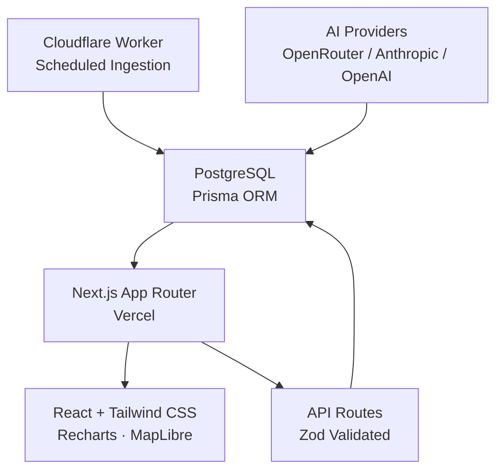

> [!NOTE]
> **WorkShift is live:** An evidence-driven, global AI Career Intelligence platform — no fabricated data, no login required.

<div align="center">

# WorkShift

### People. Skills. A Changing World.

An evidence-driven, global AI Career Intelligence platform. WorkShift
helps students, professionals, educators, researchers, and career
changers understand how AI is changing occupations, tasks, skills,
industries, and career opportunities — without login, without
fabricated statistics, and without predicting the future with false
confidence.

> This platform provides evidence-based analysis and does not
> guarantee future employment outcomes.

**[Live Demo](https://workshift-global-ai-career-intelligence.vercel.app)** · **[Methodology](https://workshift-global-ai-career-intelligence.vercel.app/methodology)**

---

</div>

> [!TIP]
> **No account needed.** Every page on the public site is fully accessible without login or signup. The admin dashboard is the only protected route.

## Table of Contents

- [What is WorkShift?](#what-is-workshift)
- [Key Capabilities](#key-capabilities)
- [Architecture](#architecture)
- [Quick Start](#quick-start)
- [Deployment](#deployment)
- [Testing](#testing)
- [Documentation](#documentation)
- [Data Status](#data-status)
- [Limitations](#limitations)
- [License](#license)

---

## What is WorkShift?

WorkShift is a public, evidence-driven career intelligence platform that helps you understand how AI is reshaping the world of work.

It analyzes occupations, tasks, skills, and industries using verified data sources — never fabricated statistics or false confidence. Every claim is grounded in real, linked evidence.

**No exploit, no report.** WorkShift only shows data it can trace to a verified source. If the evidence isn't there, the page shows an honest empty state instead of inventing content.

---

## Key Capabilities

- **Occupation explorer** — task-level AI exposure analysis for hundreds of occupations
- **Country pages** — honest data-coverage labeling per country, never fake national statistics
- **Skill explorer** — current exposure + demand evidence, never "future-proof" claims
- **Verified course discovery** — real provider links; "Price not verified" instead of invented prices
- **AI news & research feeds** — sourced from real, linked publishers
- **Career comparison tool** — side-by-side occupation analysis
- **AI-assisted recommendations** — grounded only in real database records, no account required
- **Fully public** — no login/signup anywhere on the main site
- **Admin dashboard** — protected internal view for pipeline/source health
- **Transparent methodology** — versioned scoring at `/methodology`

---

## Architecture



**Stack:**
- **Frontend:** Next.js 14 (App Router), React, TypeScript, Tailwind CSS
- **Backend:** Next.js route handlers, Cloudflare Workers
- **Database:** PostgreSQL (Neon/Supabase), Prisma ORM
- **AI:** Provider-agnostic — OpenRouter, Anthropic, OpenAI, Gemini, Groq
- **Validation:** Zod schemas for all AI outputs
- **Hosting:** Vercel (app), Cloudflare (Workers/CDN/WAF)

See [`docs/architecture.md`](docs/architecture.md) for the full breakdown.

---

## Quick Start

### Prerequisites

- **Node.js 18+**
- **PostgreSQL** — [Neon](https://neon.tech) or [Supabase](https://supabase.com) (free tier works)
- **AI provider key** — at least one of: OpenRouter, Anthropic, OpenAI, Gemini, Groq

### Run Locally

```bash
git clone https://github.com/jojin1709/workshift.git
cd workshift
npm install
cp .env.example .env   # fill in your values
npm run db:migrate:dev
npm run dev
```

Open [http://localhost:3000](http://localhost:3000).

> [!WARNING]
> The app runs with an **empty database** out of the box. Every page shows honest empty states until you configure and run real ingestion. See [Data Status](#data-status).

### Environment Variables

| Variable | Required | Description |
|----------|----------|-------------|
| `DATABASE_URL` | ✅ | PostgreSQL connection string |
| `DIRECT_DATABASE_URL` | ✅ | Direct (non-pooled) connection for migrations |
| `OPENROUTER_API_KEY` | Recommended | OpenRouter API key (free models available) |
| `AI_PROVIDER_PRIORITY` | Optional | Comma-separated provider order (default: `anthropic,openai,google,openrouter,groq`) |
| `NEXT_PUBLIC_SITE_URL` | Optional | Production URL |
| `ADMIN_SESSION_SECRET` | Optional | Secret for admin dashboard auth |
| `REDIS_URL` | Optional | Rate limiting (falls back to in-memory) |

See [`.env.example`](.env.example) for the full list.

---

## Deployment

### Vercel (Next.js App)

1. Push to GitHub
2. Import repo on [vercel.com](https://vercel.com)
3. Add environment variables in the Vercel dashboard
4. Deploy

### Cloudflare (Scheduled Worker)

```bash
wrangler login
wrangler secret put DATABASE_URL
wrangler secret put OPENROUTER_API_KEY
npm run worker:deploy
```

### Post-Deploy Checklist

- [ ] `/api/health` returns `{ status: "ok" }`
- [ ] `/api/stats` returns real counts
- [ ] `/admin` requires login and is `noindex`
- [ ] At least one source enabled in `lib/ingestion/source-registry.ts`

See [`docs/deployment.md`](docs/deployment.md) for full details.

---

## Testing

```bash
npm run lint              # ESLint
npm run typecheck         # TypeScript
npm run test              # Unit tests (Vitest)
npm run test:integration  # Integration tests (requires DATABASE_URL)
npm run test:e2e          # Playwright e2e (requires running app)
npm run quality:scan      # Scans for placeholder/fake-data markers
```

---

## Documentation

| Guide | Description |
|-------|-------------|
| [`docs/architecture.md`](docs/architecture.md) | Full system architecture |
| [`docs/ai-system.md`](docs/ai-system.md) | AI provider abstraction and task system |
| [`docs/database.md`](docs/database.md) | Database schema and design |
| [`docs/data-pipeline.md`](docs/data-pipeline.md) | Ingestion pipeline and adapters |
| [`docs/scoring-methodology.md`](docs/scoring-methodology.md) | Exposure scoring methodology |
| [`docs/security.md`](docs/security.md) | Security practices and threat model |
| [`docs/data-quality.md`](docs/data-quality.md) | Data quality standards |
| [`docs/deployment.md`](docs/deployment.md) | Vercel + Cloudflare deployment guide |

---

## Data Status

**This repository ships with zero seeded records.** It was built in an environment without general internet access, so no real data could be verified and ingested here.

Every source in the registry is marked `UNSUPPORTED` with a documented placeholder, and every page renders its correct, honest empty state:

- "Insufficient reliable data"
- "No verified updates are currently available"

Rather than showing invented content. See [`docs/data-quality.md`](docs/data-quality.md) for how to bring in real data.

---

## Limitations

- No source has been ingested or verified from this build environment.
- The HTML scraping adapter requires a DOM parser to be wired in at deploy time.
- E2E tests assume a running instance with seeded data.
- Admin auth is a minimal signed-cookie mechanism; swap in SSO/OAuth for larger deployments.

---

## License

Choose and add a license appropriate for your deployment (e.g. MIT, Apache-2.0). None is bundled by default.

---

<div align="center">

**Built with evidence, not speculation.**

</div>
